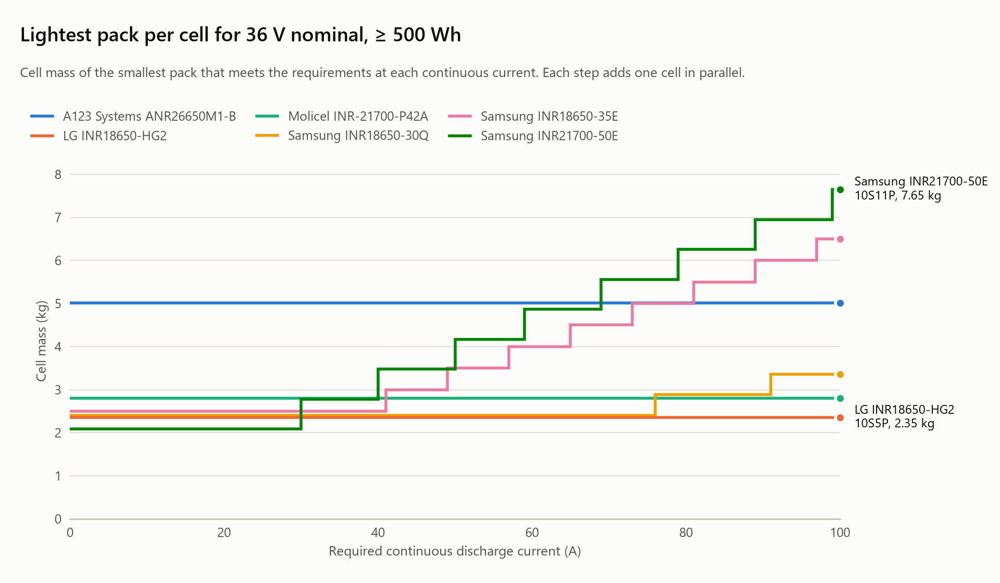
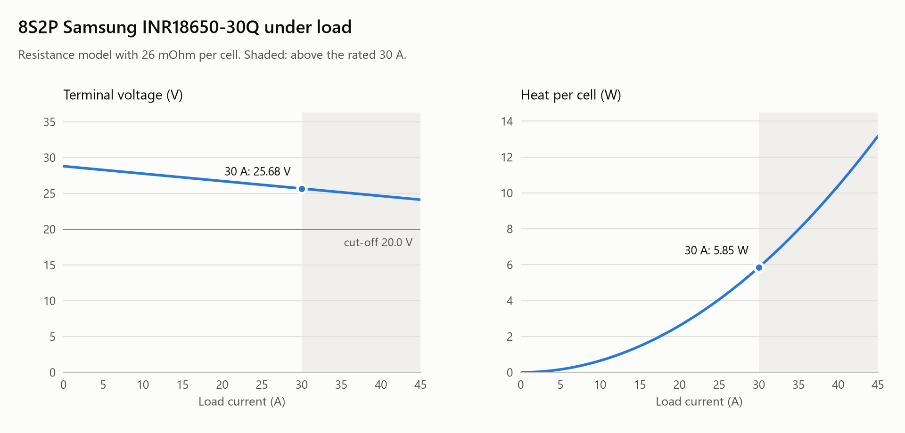

# Battery Pack Designer

[](https://github.com/zero705/battery-pack-designer/actions/workflows/ci.yml)


A command-line tool and Python library for sizing and analysing **series/parallel
lithium-ion battery packs** from manufacturer datasheet values: voltage window, energy,
current capability, voltage sag, heat per cell, runtime, main fuse and wire gauge.

It answers the questions that come first in any battery project, such as an e-bike,
a small electric vehicle or a battery management system (BMS) test bench:

- *Which cell, and how many in series and in parallel?*
- *How hot will the cells get at full current?*
- *Which fuse and which wire do I need between the pack and the load?*

Every equation is documented in [docs/theory.md](docs/theory.md), and every cell value
is traceable to a named manufacturer datasheet, so each result can be checked by hand.

<picture>
  <source media="(prefers-color-scheme: dark)" srcset="docs/images/tradeoff-dark.png">
  
</picture>

*The best cell depends on the current. For a 36 V, 500 Wh pack the high-energy Samsung
50E is lightest below 30 A; from there its 9.8 A limit forces extra cells in parallel and
the high-power LG HG2 wins. Generated with `packdesign plot tradeoff`.*

## Features

- **Analyse** any `SxP` configuration: voltage window, capacity, energy, internal
  resistance, voltage under load, output power, heat per cell and runtime.
- **Design** packs from requirements (voltage, energy or capacity, discharge and charge
  current, mass and voltage limits) and rank candidates across a cell library. Every
  rejected cell comes with a reason.
- **Protect**: selects the main fuse, then the thinnest AWG wire that can carry the fuse
  rating and meets a voltage-drop limit.
- **Plot** voltage sag and heat per cell against load, and the cell trade-off as the
  current requirement rises, as PNG, SVG or PDF in a light or dark theme.
- **Datasheet-traceable cell library**: six common cells (Samsung, LG, Molicel, A123),
  each citing its source document, plus your own cells from a JSON file.
- **Three output formats**: aligned text, Markdown (for reports and issues) and JSON
  (for scripts).
- **Engineering-grade code**: the calculator has no runtime dependencies (charts use
  optional matplotlib), `mypy --strict`, 100 % test coverage, CI on Linux and Windows
  with Python 3.10 to 3.14.

## Installation

Requires Python 3.10 or newer. Clone this repository, then install from its folder:

```bash
git clone https://github.com/zero705/battery-pack-designer.git
cd battery-pack-designer
python -m pip install .            # the calculator (no dependencies)
python -m pip install ".[plot]"    # plus charts (adds matplotlib)
```

This installs the `packdesign` command. `python -m packdesign` works too.

## Quick start

### Analyse a pack

An 8S2P pack of Samsung 30Q cells at its full rated current:

```console
$ packdesign analyze --cell samsung-30q --series 8 --parallel 2
Battery pack 8S2P: Samsung INR18650-30Q (li-ion, 18650)
=======================================================

Electrical
  Cells                       16 (8 series x 2 parallel)
  Voltage (min / nom / max)   20.0 / 28.8 / 33.6 V
  Capacity                    5.90 Ah
  Energy                      169.9 Wh
  Internal resistance         104.0 mOhm (cells)
  Max continuous current      30.0 A
  Max continuous power        770 W
  Max charge current          8.0 A

Mechanical
  Cell mass                   0.768 kg
  Specific energy (cells)     221 Wh/kg

Operating point at 30 A (5.08C)
  Voltage under load          25.68 V
  Output power                770 W
  Heat in cells               93.6 W (5.85 W per cell)
  Ideal runtime               11.8 min
  Within cell rating          yes

Main wiring (0.5 m one-way)
  Fuse                        40 A
  Wire                        10 AWG (5.26 mm2, rated 42 A)
  Voltage drop                0.098 V (0.34%)
  Wire loss                   2.95 W
```

Almost 6 W of heat inside each cell at full current is why a real pack needs thermal
design and temperature sensing. Use `--load 15` to evaluate another current,
`--wire-length` and `--max-drop` for the cable, and `--format markdown` or
`--format json` for other outputs.

The same pack as a chart (`packdesign plot load --cell samsung-30q -s 8 -p 2 -o load.png`):

<picture>
  <source media="(prefers-color-scheme: dark)" srcset="docs/images/load-dark.png">
  
</picture>

Voltage falls linearly with current, but heat grows with its square: going from 30 A to
45 A raises the heat in each cell from 5.85 W to over 13 W.

### Design a pack from requirements

A 36 V e-bike pack with at least 500 Wh that delivers 20 A continuously:

```console
$ packdesign design --voltage 36 --energy 500 --current 20
Pack design: 36 V nominal, >= 500 Wh, 20 A continuous
=====================================================

#  Cell                    Config  Cells  V nom  V max    Ah   Wh  Max A  Mass kg  Sized by
-  ----------------------  ------  -----  -----  -----  ----  ---  -----  -------  --------
1  Samsung INR21700-50E    10S3P      30   36.3   42.0  14.7  534     29     2.08  energy
2  LG INR18650-HG2         10S5P      50   36.0   42.0  15.0  540    100     2.35  energy
3  Samsung INR18650-30Q    10S5P      50   36.0   42.0  14.8  531     75     2.40  energy
4  Samsung INR18650-35E    10S5P      50   36.0   42.0  16.8  603     40     2.50  energy
5  Molicel INR-21700-P42A  10S4P      40   36.0   42.0  16.0  576    180     2.80  energy

(1 more feasible design(s) not shown; use --top to see more)
```

At 20 A every design is sized by energy, so the cell with the most energy per gram, the
high-energy 50E, gives the lightest pack. Ask for 60 A (`--current 60`) and the ranking
changes: the 50E's 9.8 A limit forces 7 cells in parallel, and the high-power HG2 wins.

Other useful options: `--series 8` instead of `--voltage`, `--capacity`,
`--charge-current`, `--max-voltage 60`, `--max-mass 2.5`, `--chemistry lifepo4`,
`--sort cells|energy|mass`, `--top 10` and `--show-rejected`.

### List the cells

```console
$ packdesign cells
Cell library
============

ID            Cell                       Chem.    Size   V nom    Ah  Max A    Wh  Mass g
------------  -------------------------  -------  -----  -----  ----  -----  ----  ------
a123-26650    A123 Systems ANR26650M1-B  lifepo4  26650   3.30  2.40     50   7.9    76.0
lg-hg2        LG INR18650-HG2            li-ion   18650   3.60  3.00     20  10.8    47.0
molicel-p42a  Molicel INR-21700-P42A     li-ion   21700   3.60  4.00     45  14.4    70.0
samsung-30q   Samsung INR18650-30Q       li-ion   18650   3.60  2.95     15  10.6    48.0
samsung-35e   Samsung INR18650-35E       li-ion   18650   3.60  3.35      8  12.1    50.0
samsung-50e   Samsung INR21700-50E       li-ion   21700   3.63  4.90    9.8  17.8    69.5
```

### Use your own cells

Describe cells in a JSON file (see [examples/custom_cells.json](examples/custom_cells.json))
and pass it to any command. Cells with the same id as a built-in cell replace it.

```bash
packdesign design --voltage 48 --energy 1000 --current 30 --cells-file my_cells.json
```

### Draw charts

Charts need the `plot` extra (`python -m pip install ".[plot]"`). The file extension
picks the format (`.png`, `.svg` or `.pdf`) and `--theme dark` switches colours.

```bash
# Voltage and heat per cell against load current
packdesign plot load --cell samsung-30q -s 8 -p 2 -o load.png

# Lightest pack per cell as the current requirement rises, two cells labelled
packdesign plot tradeoff --voltage 36 --energy 500 --max-current 100 \
    --highlight samsung-50e lg-hg2 -o tradeoff.png
```

`plot tradeoff` also accepts `--series`, `--capacity`, `--max-voltage`, `--max-mass` and
`--chemistry`. The colour palette is validated for colour-vision deficiency in both
themes, and each cell keeps its colour when others are filtered out.

## Cell data

The built-in values are transcribed from the manufacturers' own datasheets. The design
is deliberately conservative:

| Field | Rule |
|---|---|
| Capacity | **Minimum** capacity guaranteed by the datasheet; the nominal value only when no minimum is published. This is why the "3000 mAh" 30Q is listed as 2.95 Ah. |
| Charge current | Maximum charge current; the standard charge current when no maximum is published. |
| Resistance | DC resistance when published, otherwise the 1 kHz AC impedance (maximum when specified). |
| Mass | Maximum weight when specified, otherwise nominal weight. |

| Cell | Source document | Capacity | Resistance basis |
|---|---|---|---|
| Samsung INR18650-30Q | Samsung SDI cell specification, version 1.0 | 2.95 Ah (minimum) | AC 1 kHz, max |
| LG INR18650-HG2 | LG Chem BCY-PS-HG2-Rev0 (2014-10-13) | 3.00 Ah (nominal) | AC 1 kHz, max |
| Samsung INR18650-35E | Samsung SDI cell specification, version 1.1 | 3.35 Ah (minimum) | AC 1 kHz, max |
| Molicel INR-21700-P42A | Molicel product data sheet 80092, V4 | 4.00 Ah (minimum) | DC 10 A / 1 s, typical |
| Samsung INR21700-50E | Samsung SDI cell specification, version 1.0 (2018-07-11) | 4.90 Ah (minimum) | AC 1 kHz, max |
| A123 ANR26650M1-B | A123 Systems MD100113-02 (2012) | 2.40 Ah (minimum) | AC 1 kHz, typical |

A test pins every value to this table, so the library cannot drift silently. Per-cell
notes (for example, that the A123 datasheet gives no cut-off voltage and 2.0 V is where
its discharge curves end) are in [cells.json](src/packdesign/data/cells.json) and in the
`--format json` output.

## Python API

```python
from packdesign import CellLibrary, PackConfig, plan_main_wiring

cell = CellLibrary.builtin().get("samsung-30q")
pack = PackConfig(cell, series=8, parallel=2)
load = pack.at_load(30.0)
plan = plan_main_wiring(30.0, one_way_length_m=0.5, system_voltage_v=pack.nominal_voltage_v)

print(f"{pack.label}: {pack.energy_wh:.1f} Wh")  # 8S2P: 169.9 Wh
print(f"{load.voltage_under_load_v:.1f} V")  # 25.7 V
print(f"{load.heat_per_cell_w:.2f} W")  # 5.85 W
print(f"{plan.fuse_rating_a:g} A, {plan.wire.awg} AWG")  # 40 A, 10 AWG
```

`design_packs(cells, Requirements(...))` returns ranked candidates and the rejected
cells with reasons. This example is part of the test suite, so it stays correct.

## How it works

| Step | Model |
|---|---|
| Pack values | `V = S x V_cell`, `C = P x C_cell`, `I_max = P x I_cell` |
| Voltage sag and heat | `R_pack = R_cell x S / P`, `V = V_nom - I x R_pack`, `P_heat = I^2 x R_pack` |
| Fuse | next standard rating >= 1.25 x continuous current |
| Wire | thinnest AWG with `area x 8 A/mm2 >= fuse rating` and drop <= 2 % |
| Sizing | `S` from the voltage target, `P` = the largest need of energy, capacity, discharge and charge current |

See [docs/theory.md](docs/theory.md) for the full derivation with a worked example.

## Assumptions and limitations

This is a first-order sizing tool, not a replacement for testing.

- **Resistance:** most datasheets only publish the 1 kHz AC impedance, which is lower
  than the DC resistance that causes voltage sag and heat under load. For those cells
  the sag and heat figures are optimistic; treat them as a lower bound.
- **Voltage sag** uses a single resistance at nominal voltage. Real sag also depends on
  state of charge, temperature and pulse length.
- **Mass** covers the cells only. Holders, nickel strip, BMS, wiring and enclosure
  typically add 20-40 %.
- **Wire ampacity** uses a design current density (default 8 A/mm2) for short,
  single, silicone-insulated conductors in free air. Bundled or enclosed wiring needs a
  lower value; always check the wire manufacturer's rating.
- **Datasheets are revised.** Check the latest revision before building anything.
- **Safety:** lithium-ion packs store a lot of energy. Real packs need a BMS, correct
  fusing, insulation and safe assembly practice.

## Project structure

```
battery-pack-designer/
|-- src/packdesign/
|   |-- cells.py        Cell model, validation and cell library (JSON)
|   |-- pack.py         Series/parallel pack model and load-point analysis
|   |-- wiring.py       AWG geometry, wire and fuse selection
|   |-- design.py       Requirements and pack sizing / ranking
|   |-- report.py       Text, Markdown and JSON output
|   |-- plots.py        Charts (optional matplotlib)
|   |-- cli.py          Command-line interface
|   `-- data/cells.json Built-in cell library with sources
|-- tests/              pytest suite: maths, datasheet values, charts, CLI and README examples
|-- docs/theory.md      Equations and worked example
|-- docs/images/        README charts (light and dark)
`-- examples/           Example custom cell file
```

## Development

```bash
python -m venv .venv
source .venv/bin/activate        # Windows: .venv\Scripts\activate
python -m pip install -e ".[dev]"

pytest --cov                     # 166 tests, 100 % coverage
ruff check . && ruff format --check .
mypy                             # strict type checking
```

The README charts in `docs/images/` are regenerated with:

```bash
for theme in light dark; do
  packdesign plot tradeoff --voltage 36 --energy 500 --max-current 100 \
      --highlight samsung-50e lg-hg2 --theme $theme -o docs/images/tradeoff-$theme.png
  packdesign plot load --cell samsung-30q -s 8 -p 2 --theme $theme -o docs/images/load-$theme.png
done
```

Continuous integration runs the linters, type checks and tests on Linux and Windows
with Python 3.10 to 3.14 for every push and pull request.


[GitHub](https://github.com/zero705) ·
[LinkedIn](https://www.linkedin.com/in/%C3%B6mer-faruk-%C5%9Fenol-2778a63b5/)

## License

[MIT](LICENSE)
